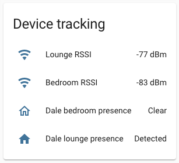
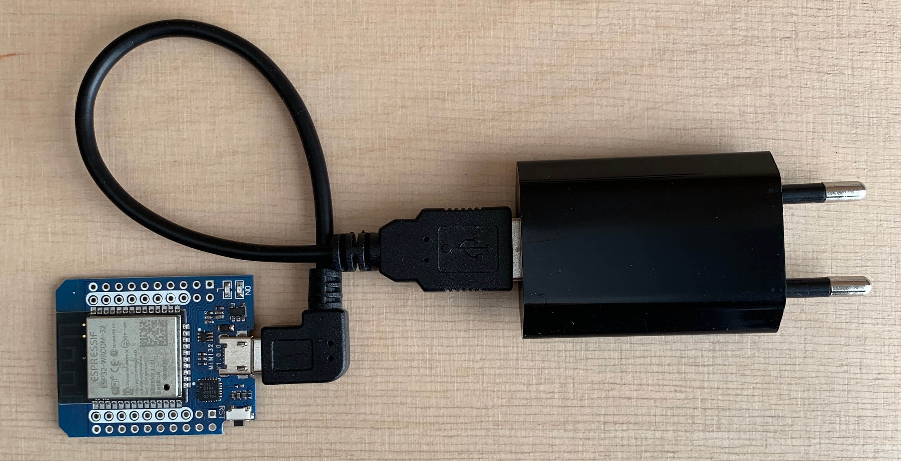
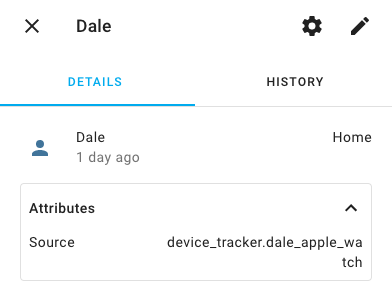
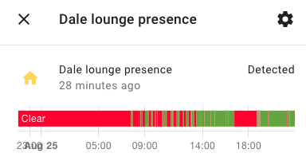

# ESPHome BLE Apple Watch presence detection

An [ESPHome](https://esphome.io/) config for ESP32 to reliably detect an Apple Watch for room level presence detection for use with Home Assistant.

Full working example: [`lounge.yaml`](lounge.yaml)




## How BLE tracking works
To track a person or object, you attach a [BLE](https://en.wikipedia.org/wiki/Bluetooth_Low_Energy) tag like [TrackR](https://www.thetrackr.com/). Every few seconds the tracker broadcasts its presence to all listening receivers. It is identified by its unique MAC address. A BLE receiver, like the Raspberry Pi running [room assistant](https://www.room-assistant.io/), or ESP32 with [ESPHome BLE RSSI sensor](https://esphome.io/components/sensor/ble_rssi.html) detects the broadcast and records the received signal strength ([RSSI](https://en.wikipedia.org/wiki/Received_signal_strength_indication)). If the signal is weak then the tag is far away, and if the signal is strong then the tag is near. You can use this to infer whether the tag is in the room or not, and base home automation on the tags presence or absence.

I didn't want to wear a BLE tag for home automation. But I do always wear my Apple Watch, and I know that has Bluetooth.


## Apple Watch BLE tracking
Apple devices use BLE broadcasts to notify other Apple devices of their proximity, for use in Handoff, Find My and Airdrop. This is the Apple Continuity Protocol and has been somewhat [reverse engineered](https://github.com/furiousMAC/continuity).

However, for privacy reasons – to prevent tracking, the exact thing I want to do – Apple randomly generates a new MAC address about every 45 minutes. Without a stable MAC address, how can you tell which broadcast is your watch?

One of the Apple Watch broadcasts is the [Nearby Info](https://github.com/furiousMAC/continuity/blob/master/messages/nearby_info.md) message. It is transmitted every few seconds, and it has enough information to reliably find an Apple Watch amongst all other BLE broadcast messages.

### Apple Watch Nearby Info message
An example of the Nearby Info message (in hex) split for easier reading: `4c00 10 05 01 98 86b356`, where

- `4c00` is Apple's manufacturer identifier. All Apple BLE broadcasts start with this 16-bit number
- `10` identifies the Nearby Info message
- `05` is the length: 5 bytes to follow
- `01` is the status flags and action code. Appears to be in the range 01 .. 0F
- `98` the Data flags. If the watch is unlocked it is `98`, and if locked (e.g. on night stand, not on wrist) then it is `18`
- `86b356` is 3 byte Authentication tag. There is no useful info here as it changes continuously

I can reliably detect an Apple Watch by searching all broadcast messages for Apple manufacturer ID `4c00` with data field that starts with `10 05 0X 98`, where X is 0 through F.

### How do you know if this is _your_ Apple Watch?
Although I have not yet done this, you can confirm that it is your Apple watch by connecting to the device, listing all services, and then going through each service looking for the characteristic ID `Model Number String` that has a value such as `Watch3,3`. 

As long as you're the only person with a series 3 Apple Watch with hardware revision 3 in your house, you will reliably be able to track yourself.

You can then store the MAC address until it cycles in ~45 minutes. When the MAC does change you rescan for the Nearby Info message `4c00 10 05 01 98` and service characteristic `Model Number String` `Watch3,3`.


## Tracking Apple Watch with ESPHome
In each room where I want BLE tracking I have an [ESP32 D1 mini](https://www.alibaba.com/products/d1_mini_esp32.html?IndexArea=product_en&tab=rts) running ESPHome.



Each ESP32 continually scans for the Nearby Info BLE message, and when it finds it, gets the signal strength (RSSI). The strength fluctuates depending where you are in the room and how much of your body is shielding the watch from the receiver. A number of filters reduce the noise, and then make the decision whether you are in the room or not. The RSSI and presence is sent to Home Assistant via the native API, and also published to MQTT for use by e.g. Node-RED.

### Config file explanation
I have templatised the [`lounge.yaml`](lounge.yaml) as much as possible. 

```yaml
substitutions:
  roomname: bedroom
  static_ip: 10.0.0.16
  yourname: Dale
  rssi_present: id(harssi_present).state
  rssi_not_present: id(harssi_not_present).state
```

`roomname`, `static_ip` and `yourname` should be self explanatory. 

`rssi_present` and `rssi_not_present` are the upper and lower limits of signal strength that determine if you are present in a room or not.  Anything stronger than the value in 'rssi_present' and you are considered present. Anything below the value of 'rssi_not_present' means that you are definitly not present in the room. (RSSI values are always negative. The closer to 0 a number is, the stronger the signal is: -50 is much stronger than -100.) 

These values are pulled from two input.number helpers that will need to be created in Home Assistant. (See https://my.home-assistant.io/redirect/helpers/) The values are pulled into your ESPhome configuration using the two sensors configurations below. The "XXXXXXX" will need to be replaced with the entity_id of the input.number helpers you have already created. The input.number helpers should be created with a minimum value of -100, a maximum value of 0, and a unit of measurement of dBm. 

```
sensor:
  - platform: homeassistant
    name: HA RSSI Present Value
    entity_id: input_number.XXXXXXXX
    id: harssi_present
  - platform: homeassistant
    name: HA RSSI Not Present Value
    entity_id: input_number.XXXXXXXX
    id: harssi_not_present
```    


The detection works as follows:

```yaml
esp32_ble_tracker:
  scan_parameters:
    interval: 1.2s
    window: 500ms
    active: false
  on_ble_advertise:
    - then:
      # Look for manufacturer data of form: 4c00 10 05 YY 98 XXXXXX
      # Where YY can be 01..0F or 20..2F; and XXXXXX is ignored
      - lambda: |-
          optional<int16_t> best_rssi = nullopt;
          for (auto data : x.get_manufacturer_datas()) {
            // Guard against non-Apple datagrams, or those that are too small.
            if (data.data.size() < 4 || data.uuid.to_string() != "0x004C" || data.data[0] != 0x10 || data.data[1] < 5) {
              continue;
            }
            const int16_t rssi = x.get_rssi();
            const uint8_t status_flags = data.data[2] >> 4;  // High nibble
            const uint8_t data_flags = data.data[3];
            if (data_flags == 0x98) {  // Match unlocked Apple Watches
              if (status_flags == 0 || status_flags == 2) {
                best_rssi = max(rssi, best_rssi.value_or(rssi));
                ESP_LOGD("ble_adv", "Found Apple Watch (mac %s) rssi %i", x.address_str().c_str(), rssi);
              } else {
                ESP_LOGD("ble_adv", "Possible Apple Watch? (mac %s) rssi %i, unrecognised status/action flags %#04x", x.address_str().c_str(), rssi, data.data[2]);
              }
            }
          }
          if (best_rssi) {
            id(apple_watch_rssi).publish_state(*best_rssi);
          }
```

This uses ESPHome's [`esp32_ble_tracker`](https://esphome.io/components/esp32_ble_tracker.html) sensor. I've increased the `interval` and `window` to give as much time to detect the watch broadcast, but also enough time for the ESP32 to switch to WiFi to send results to MQTT and HA. We only listen for broadcasts, so `active: false`.

On all broadcasts, a lambda is run which looks for the manufacturer UUID `004c` (note: big-endian), and manufacturer data that starts with `10 05 0X 98`. Byte 2 appears to always be in the range `01` through `0F` for Series 2 and 5, and `21` through `2F` for Series 6. I am specifically looking for when the watch is **unlocked** (i.e. on my wrist) so that tracking stops when I take my watch off and it auto-locks. In unlocked state, byte 3 is `98`. Locked state changes byte 3 to `18`. (All values hex.)

For the case where multiple Apple Watches are detected, the strongest RSSI is published. As long as one watch is in the room, then the room is occupied.

The lambda publishes the RSSI to the `apple_watch_rssi` template sensor:

```yaml
  - platform: template
    id: apple_watch_rssi
    name: "$yourname Apple Watch $roomname RSSI"
    device_class: signal_strength
    unit_of_measurement: dBm
    accuracy_decimals: 0
    filters:
      - exponential_moving_average:
          alpha: 0.3
          send_every: 1
    on_value:
      then:
        - lambda: |-
            if (id(apple_watch_rssi).state > $rssi_present) {
              id(room_presence_debounce).publish_state(1);
            } else if (id(apple_watch_rssi).state < $rssi_not_present) {
              id(room_presence_debounce).publish_state(0);
            }
        - script.execute: presence_timeout  # Publish 0 if no rssi received
```

This applies an [`exponential_moving_average`](https://esphome.io/components/sensor/index.html#exponential-moving-average) filter. The `alpha` is fairly high to make it responsive when I actually change rooms, but just 'forgetful' enough to smooth out a lot of the random RSSI fluctuations.

Next apply hysteresis, so that only if the signal is stronger than `rssi_present` are you present (publish `1` to `room_presence_debounce` sensor), and only not present (publish `0`) when signal strength of the watch is below `rssi_not_present`. If the RSSI is between these two values then it does not publish anything, and the system will stay in its current state: You either stay present or not present.

We also start a `presence_timeout` script, so that if no signal is detected (maybe you leave the house), then  publish a `0` value to indicate not present. 

```yaml
script:
  # Publish event every 30 seconds when no rssi received
  id: presence_timeout
  mode: restart
  then:
    - delay: 30s
    - lambda: |-
        id(room_presence_debounce).publish_state(0);
    - script.execute: presence_timeout
```

The script is called each time an RSSI value is published. A 30 second delay timer is started. If the script is called again before the 30s delay is over, because of `mode: restart` the script is restarted, and the delay time is reset to 30s and `0` is never published. If no RSSI value has been received for 30s then publish a state of not present (`0`), and call the script again. Not present will continue to be published every 30s for as long as the Apple Watch is not detected.

Next is the debounce sensor:

```yaml
  - platform: template
    id: room_presence_debounce
    filters:
      - sliding_window_moving_average:
          window_size: 3
          send_every: 1
```

in conjunction with the room presence binary sensor:

```yaml
binary_sensor:
  - platform: template
    id: room_presence
    name: "$yourname $roomname presence"
    device_class: occupancy
    lambda: |-
      if (id(room_presence_debounce).state > 0.99) {
        return true;
      } else if (id(room_presence_debounce).state < 0.01) {
        return false;
      } else {
        return id(room_presence).state;
      }
```

The debounce sensor requires 3 consecutive readings to be the same to change presence. I use `0.99` and `0.01` in case there are floating point rounding issues with the [`sliding_window_moving_average`](https://esphome.io/components/sensor/index.html#sliding-window-moving-average) filter.

The RSSI signal strength and room presence status are published to the Home Assistant native API as well as MQTT each time they change.


## Integration to Home Assistant

Add the ESP32 tracker to Home Assistant using the [ESPHome integration](https://www.home-assistant.io/integrations/esphome/). You should see a new device with two entities: one for RSSI and the other for room presence.

### Automations
Using room presence to automate turning on lights when you enter a room after dark. In your Home Assistant's `automations.yaml` add something like:

```yaml
- id: enter_lounge_when_dark
  alias: "Turn on lounge lights on entry after sunset"
  trigger:
    - platform: state
      entity_id: binary_sensor.dale_lounge_presence
      to: "on"
  condition:
    - condition: numeric_state
      entity_id: sun.sun
      attribute: elevation
      below: 0
  action:
    - service: light.turn_on
      entity_id: light.lounge_light
```

### Device Tracker


I wanted Home Assistant to use my Apple Watch to determine whether I was `home` or `not_home`. This is done by using the presence binary sensors as a [device tracker](https://www.home-assistant.io/integrations/device_tracker/). You have to do this with an automation. 

In `automations.yaml` I added the following:

```yaml
- id: dale_apple_watch_device_tracker
  alias: Dale Apple Watch Tracker
  trigger:
    - platform: state
      entity_id: binary_sensor.dale_bedroom_presence
    - platform: state
      entity_id: binary_sensor.dale_lounge_presence
  action:
    - service: device_tracker.see
      data:
        dev_id: dale_apple_watch
        location_name: >
          
            home
          
            not_home
          
            unknown
          
        source_type: "bluetooth_le"
```

The automation is called when any of the BLE trackers changes state. When any tracker detects my watch (note `or`) then I am `home`; when none of the trackers can detect my watch (note `and`) then I am `not_home`; and at start-up when the sensors haven't been initialised then the state is `unknown`. The `device_tracker.see` service adds my apple watch to `known_devices.yaml`, and makes the device tracker available as an entity.

From there, you can add the device tracker to yourself in People, and HA will use that (as well as your other device trackers) to determine if you are home or not.




## Reliability
The BLE tracker itself works very well. However, RSSI fluctuates wildly depending on where in the room you are, how your arm/watch is positioned, and the position of the ESP32 receiver. There is a trade-off between reliability and speed: Filters could reduce the false detections, but would be slow to change (and therefore automations would be slow to act), or automations can be fast, but trigger when they shouldn't.

My goal is to have an automation trigger within 3-5 seconds of entering a room, and never when I am not in the room. 

As you can see from the image below, even though I am in the lounge almost the entire day (my home office desk is there), presence detection is noisy.



You will have to adjust the RSSI detection limits and filters and the position of your ESP32 in the room for best reliability. In short, don't expect miracles.

I find that a hybrid approach is best: 
- Use PIR to trigger automations like switching on the lights when entering a room
- Use BLE presence detection to know that you are still in the room, even when not moving (like working from a desk.)


## Tested and works with
- ESPHome 2021.8
- Generic MINI32 board (ESP32 with integrated 5V to 3V and USB to serial converter)
- Apple Watch Series 3 (`Watch3,3`)
- Apple Watch Series 5 (`Watch5,2`)
- Apple Watch Series 6
- My house is made from brick with a concrete slab between the bedroom and lounge, so signal attenuates rapidly


## Prior work on fingerprinting Apple device
- [Apple device continuity](https://github.com/furiousMAC/continuity)
- https://petsymposium.org/2020/files/papers/issue1/popets-2020-0003.pdf
- https://arxiv.org/pdf/1703.02874.pdf
- https://samteplov.com/uploads/shmoocon20/slides.pdf
- https://i.blackhat.com/eu-19/Thursday/eu-19-Yen-Trust-In-Apples-Secret-Garden-Exploring-Reversing-Apples-Continuity-Protocol-3.pdf


## Similar presence detection projects
- [room-assistant](https://www.room-assistant.io/guide/) using Raspberry Pi Zero
- [ESP32-mqtt-room](https://github.com/jptrsn/ESP32-mqtt-room) using ESP32, but not ESPHome


## Contributing
This has been tested on Series 3, 5, 6 Apple Watches. If this doesn't work on your Apple watch please open an Issue.

I'd prefer that this was a custom ESPHome sensor, similar to [Xiaomi Mijia BLE Sensors](https://esphome.io/components/sensor/xiaomi_ble.html), instead of 100 lines of yaml. If you can help with the C, please let me know.

All feedback welcome.
